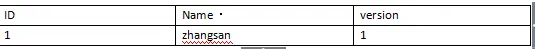
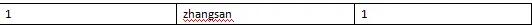
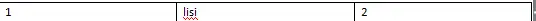
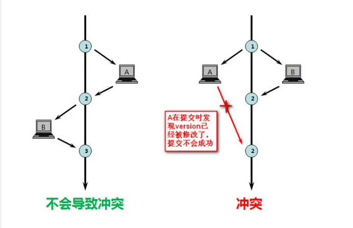

[toc]
## 乐观锁和悲观锁
[here](https://zhuanlan.zhihu.com/p/31537871)
* **悲观锁：** 是基于一种悲观的态度类来防止一切数据冲突，它是以一种预防的姿态在修改数据之前把数据锁住，然后再对数据进行读写，在它释放锁之前任何人都不能对其数据进行操作，直到前面一个人把锁释放后下一个人数据加锁才可对数据进行加锁，然后才可以对数据进行操作，一般数据库本身锁的机制都是基于悲观锁的机制实现的;
**特点：** 可以完全保证数据的独占性和正确性，因为每次请求都会先对数据进行加锁， 然后进行数据操作，最后再解锁，而加锁释放锁的过程会造成消耗，所以性能不高;
* **乐观锁：** 是对于数据冲突保持一种乐观态度，操作数据时不会对操作的数据进行加锁（这使得多个任务可以并行的对数据进行操作），只有到数据提交的时候才通过一种机制来验证数据是否存在冲突(**一般实现方式是通过加版本号然后进行版本号的对比方式实现**);
**特点：** 乐观锁是一种并发类型的锁，其本身不对数据进行加锁通而是通过业务实现锁的功能，不对数据进行加锁就意味着允许多个请求同时访问数据，同时也省掉了对数据加锁和解锁的过程，这种方式因为节省了悲观锁加锁的操作，所以可以一定程度的的提高操作的性能，不过在并发非常高的情况下，会导致大量的请求冲突，冲突导致大部分操作无功而返而浪费资源，所以在高并发的场景下，乐观锁的性能却反而不如悲观锁。
***
**乐观锁实现形式：**

表A 字段

现在有两个请求同时操作表A

操作1先查询出需要检索的数据为：

操作2也查询出需要检索的数据为：

操作1把Name字段数据修改成lisi 比操作2先提交;

此时提交操作1会把之前查询到的version与现在的数据的version进行比较，版本相同则可以提交，版本不同则视为数据过期：

SQL语句:update A set Name=lisi,version=version+1 where ID=#{id} and version=#{version}

此时数据库变成了如下

那么最后操作2修改了数据来提交的时候是以操作1同样的方式，当然最后肯定不能提交成功，因为他手里的版本号和现在数据库里的版本号不匹配；
最后盗图一张来解释

