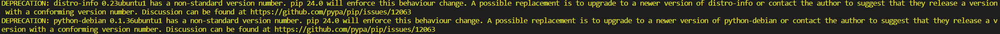

### pip
pip太老有时会无法安装某些包需要更新pip`python -m pip install --upgrade pip`

`pip install`有时出现 

```
DEPRECATION: distro-info 0.23ubuntu1 has a non-standard version number. pip 24.0 will enforce this behaviour change. A possible replacement is to upgrade to a newer version of distro-info or contact the author to suggest that they release a version with a conforming version number. Discussion can be found at https://github.com/pypa/pip/issues/12063
DEPRECATION: python-debian 0.1.36ubuntu1 has a non-standard version number. pip 24.0 will enforce this behaviour change. A possible replacement is to upgrade to a newer version of python-debian or contact the author to suggest that they release a version with a conforming version number. Discussion can be found at https://github.com/pypa/pip/issues/12063
```
解决
`pip install --upgrade distro-info`
`pip install --upgrade python-debian`

#### pip install 路径
[here](https://blog.csdn.net/mukvintt/article/details/80908951)
`python -m site`
结果：
```
PS C:\Users\翟爽> python -m site
sys.path = [
    'C:\\Users\\翟爽',
    'D:\\z\\python\\python310.zip',
    'D:\\z\\python\\DLLs',
    'D:\\z\\python\\lib',
    'D:\\z\\python',
    'D:\\z\\python\\lib\\site-packages',
]
USER_BASE: 'C:\\Users\\翟爽\\AppData\\Roaming\\Python' (doesn't exist)
USER_SITE: 'C:\\Users\\翟爽\\AppData\\Roaming\\Python\\Python310\\site-packages' (doesn't exist)
ENABLE_USER_SITE: True
```
`USER_BASE` 和`USER_SITE`其实就是用户自定义的启用Python脚本和依赖安装包的基础路径。
其中`USER_BASE`表示就是这个目录下的Python.exe启动程序路径以及pip,esay-install,markdown等脚本。
`USER_SITE`其实就是用户如果调用路径下的python.exe中的脚本pip文件去下载，就会将site-package的默认安装到这个路径下。


## Anaconda