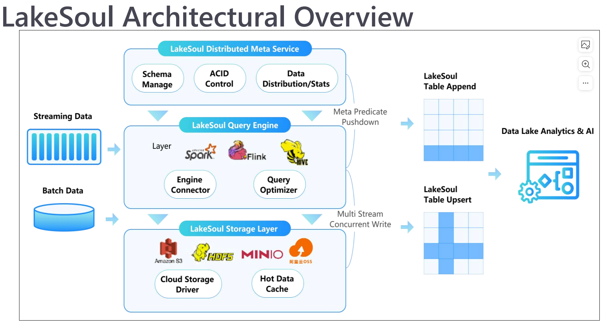

[toc]
## 关键词

### LF AI & Data
LF AI & Data 是指 "Linux Foundation for Artificial Intelligence & Data"，这是一个由 Linux 基金会（Linux Foundation）推动的开源项目和社区的组合。该项目旨在促进人工智能（AI）和数据领域的创新、合作和开放标准的发展。

### DB/MQ
* "DB/MQ" 通常指的是数据库（Database）和消息队列（Message Queue）这两个概念的结合。

### ETL&&ELT
* 项目目的："Transition from ETL to ELT" 
* 这两个术语描述了数据处理管道中的不同步骤顺序。
___
* **ETL (Extract, Transform, Load)**:
Extract (提取): 数据从源系统中提取出来，通常是从数据库、日志文件、API等。
Transform (转换): 在中间过程中对数据进行清理、变换和整理，以满足目标系统的需求，可能包括数据清理、规范化、合并等。
Load (加载): 转换后的数据被加载到目标数据仓库或数据库中，供分析和报告使用。
___
* **ELT (Extract, Load, Transform):**
Extract (提取): 数据仍然从源系统中提取，但不进行任何或仅进行最少的转换。
Load (加载): 提取的数据直接加载到目标数据仓库或数据库中，通常是原始的、未经过大规模转换的数据。
Transform (转换): 转换过程发生在目标系统中，通过目标系统内置的处理能力来进行数据变换和整理。
___
Transition from ETL to ELT:
这种转变通常意味着更多地依赖目标数据存储系统的处理能力，而不是在数据抽取和加载之间执行复杂的转换步骤。ELT的优势在于可以利用目标数据存储系统的并行处理和优化能力，同时减轻了对独立的转换服务器的需求。
这样的转变可能是出于适应性能需求、云计算平台的使用或数据处理架构的变革等原因。云数据仓库和大数据处理平台通常更适合 ELT 模型，因为它们提供了强大的处理和存储能力，可以直接在目标环境中进行数据转换。
### BI 和 Analytics
***
* **BI（Business Intelligence） - 商业智能：**
定义： 商业智能是一种技术驱动的决策支持系统，旨在帮助企业通过数据收集、分析和报告来做出更明智的商业决策。
主要目标： 提供实时、历史和预测性的洞察，帮助企业管理层和决策者更好地理解业务状况、趋势和机会，以便做出有根据的战略和操作性决策。
特点： 主要关注对已有数据的可视化、报表、仪表板和基础分析，通常在业务用户和决策者层面使用。
* **Analytics（分析）：**
定义： 分析是一种更广泛的数据处理方法，包括发现模式、趋势、关联和洞察的过程，以回答特定问题或支持决策制定。
主要目标： 通过深入挖掘数据，识别隐藏的模式和关系，以获得深层次的理解和见解。分析通常包括统计分析、数据挖掘、预测建模等。
特点： 涵盖了更广泛的数据科学领域，包括探索性分析、机器学习、人工智能等，旨在发现未知的信息，并不仅仅局限于对已有数据的可视化。
***
* 总结
BI 更侧重于提供已有数据的可视化和报表，为业务用户和决策者提供易于理解的信息，帮助他们做出实时决策。
Analytics 则更侧重于深度分析和挖掘数据，使用更先进的统计和数据科学技术，以获得深层次的见解，为企业提供更全面的数据驱动支持。

### merge on read(COW) & copy on write(MOR)
[here](https://www.dremio.com/blog/row-level-changes-on-the-lakehouse-copy-on-write-vs-merge-on-read-in-apache-iceberg/)
**dremio**和**lakesoul**很像

### Spark DataSource V2
[here](https://blog.csdn.net/penriver/article/details/115672072)

### Flink DynamicTableFactory
* DynamicTableFactory 是 Apache Flink 中的一个接口，用于创建和配置动态表的工厂。在 Flink 中，表是一种抽象，用于表示关系型的数据结构，可以从多种数据源（例如 Kafka、Hive、MySQL 等）创建。DynamicTableFactory 的目的是为这些不同的数据源提供一个统一的接口，使用户能够轻松地创建和操作动态表。

---
### object store&&s3
* **object store**
"Object store" 是指一种用于存储和检索大量**非结构化数据的数据存储系统**。它通常用于**存储对象（objects）**，这些对象可以是文本、图像、视频、音频文件等任意形式的数据。对象存储系统以对象为中心，提供简单而有效的方式来管理和检索这些对象。
对象存储在大数据、云计算和分布式系统中被广泛使用。
* **s3** (指的是**Amazon S3(Simple Storage Service)**)
著名的**对象存储服务**包括 Amazon S3（Simple Storage Service）、Google Cloud Storage、Microsoft Azure Blob Storage 等。

###
* **Streaming Data Ingestion（流式数据摄取）**
**定义：** 流式数据摄取是指将实时生成的数据从源端传输到目标端的过程。这些数据通常以流的形式生成，而不是传统的批处理方式。
**特点：** 流式数据摄取能够实时处理数据，并在数据生成时就将其传送到目标系统，以便实时分析、监控或其他即时响应的应用场景。
**应用：** 适用于需要实时处理、分析和响应的场景，如实时分析、实时监控、事件驱动应用等。
* **Incremental Pipeline（增量式管道）：**
**定义：** 增量式管道是指在数据处理管道中，仅处理数据的增量或变化部分，而不是每次都处理整个数据集。这通常涉及到检测新增、更新或删除的数据，然后仅处理这些变化。
**特点：** 增量式处理可以提高效率，特别是当数据集很大时。相对于全量处理，增量处理只需要处理发生变化的部分，减少了计算和存储的开销。
**应用：** 常用于数据仓库更新、同步、数据变更捕捉（Change Data Capture，CDC）等场景。
---
* **补充**
**CDC**是 "Change Data Capture" 的缩写，中文翻译为"数据变更捕捉"。这是一种用于监测和捕捉数据库中数据变更的技术。
CDC 通常涉及以下关键概念：
捕捉变更： CDC 系统会监测数据库的变更，包括新增、更新和删除操作。
保存元数据： CDC 会记录有关变更的元数据，例如变更发生的时间、表、字段等信息。
传递变更： 捕捉到的变更信息可以被传递给其他系统，以便它们能够实时或定期地处理这些变更。
实时性： CDC 技术通常是实时的，能够快速地捕捉到变更并将其传递给目标系统。
保留历史： 有些 CDC 系统会保留历史变更信息，以便能够查看和分析数据的演变过程。
使用 CDC 的场景包括：
数据仓库同步： 将生产数据库中的变更同步到数据仓库，以确保数据仓库中的数据保持最新。
实时数据分析： 将数据库中的变更传递给实时分析系统，以便及时获得业务见解。
数据集成： 在不同的应用系统之间同步和共享数据变更。
数据备份和恢复： 记录数据库的变更历史，以支持数据备份和恢复操作。
总体而言，CDC 技术帮助组织跟踪和理解数据库中的数据变更，使其更容易在不同系统之间实现数据同步和集成。
---

### Sink连接器
Sink 连接器是一种数据流处理中的组件，用于将处理过的数据或事件发送到外部系统或存储。在数据流架构中，数据通常从源（source）进入系统，经过一系列的处理和转换，最终到达目标（sink）。Sink 连接器负责将处理过的数据传送到目标系统，以便进一步的分析、存储或其他操作。

具体来说，Sink 连接器有以下主要功能：

数据输出： Sink 连接器从数据流中接收已经处理过的数据，然后将这些数据输出到外部系统或存储。

数据传输： 它负责将数据以适当的格式传输到目标系统，确保数据能够在系统之间有效地传递。

目标系统适配： Sink 连接器需要适配目标系统的接口和协议，以确保数据能够被目标系统正确接受和处理。

容错和事务性： 一些 Sink 连接器可能支持容错机制，以确保在发生故障时不会丢失数据。某些情况下，Sink 连接器可能还支持事务性操作，以保证数据的一致性。

在流处理框架中，Sink 连接器通常作为整个流水线的最后一步，负责将处理过的数据输出到最终的目标，如数据库、数据仓库、消息队列等。

举例来说，如果使用 Apache Kafka 作为消息队列，那么 Kafka 的 Sink 连接器可以将处理过的数据发送到 Kafka 主题，以供其他应用程序或系统进行消费。同样，如果使用数据库作为目标系统，Sink 连接器将负责将处理过的数据写入数据库表。不同的 Sink 连接器适用于不同的目标系统和使用场景。

***
### 2PC & 2PL
* **注**：虽然两阶段加锁（2PL）听起来和两阶段提交（two-phase commit, 2PC）很相似，但它们是完全不同的东西。
* 二阶段加锁：用于单机事务中的一致性和隔离性
* 二阶段提交：用于分布式事务

#### 2PC(Two-Phase Commit Protocol)
Two-Phase Commit Protocol（两阶段提交协议，简称2PC）是一种分布式事务协议，用于确保在分布式系统中执行的事务的原子性。该协议涉及到多个参与者（事务的执行者）和一个协调者（负责协调整个事务的过程）。
#### 2PL(Two-Phase Locking)
二阶段加锁：用于单机事务中的一致性和隔离性
[here](https://segmentfault.com/a/1190000012513286#item-9)
***

### Parquet-mr
Apache Parquet是一种列式存储格式，旨在提供高效的数据压缩和快速读取。而 "parquet-mr" 是 Apache Parquet 项目的 Java 实现，是 Parquet 格式的 Java 读写库。
具体来说，"parquet-mr" 提供了用于读取和写入 Parquet 格式文件的 Java API。这个库使得 Java 应用程序能够与使用 Parquet 存储的数据进行交互，无论是从 Parquet 文件中读取数据还是将数据写入 Parquet 文件。
"parquet-mr" 包含以下主要组件：

读取器（Readers）： 用于从 Parquet 文件中读取数据的组件。读取器能够解析 Parquet 文件的结构并提供对数据的访问。

写入器（Writers）： 用于将数据写入 Parquet 文件的组件。写入器能够将数据组织成 Parquet 格式，并生成 Parquet 文件。

Schema： 描述 Parquet 文件中数据的结构，包括列名、数据类型等信息。"parquet-mr" 使用 Avro 样式的 Schema，即 Apache Avro 格式的 Schema。

Compression Codecs： 提供了多种压缩算法，用于在 Parquet 文件中压缩数据。

其他工具和辅助类： 包括一些辅助类和工具，用于处理 Parquet 文件的元数据、统计信息等。

"parquet-mr" 的 Java 实现是 Apache Parquet 项目中的一个关键组件，它允许 Java 开发者在他们的应用程序中使用 Parquet 格式，从而能够充分利用 Parquet 提供的高效存储和查询性能。这对于大规模数据处理和分析任务是非常有用的，特别是在 Apache Hadoop 和 Apache Spark 等分布式计算框架中。

### Hudi & Iceberg
* Hudi
Hudi 是一个 Apache 开源项目，它为大数据湖中的增量更新（Upserts）和增量写入（Incrementals）提供了解决方案。Hudi 允许在大规模数据湖中执行事务性和增量更新，而不需要重新写入整个数据集。它主要关注的是支持 Apache Spark 和 Apache Hive 等计算框架，以及云上存储（如 Apache Hadoop Distributed FileSystem - HDFS、Amazon S3、Azure Data Lake Storage等）。
* Iceberg
Iceberg 是一种用于大规模数据湖管理的开源表格格式。它提供了一种高性能、可扩展和可靠的表格格式，用于在数据湖中存储和管理大规模数据。Iceberg 的设计目标之一是支持多种计算引擎，例如 Apache Spark、Presto、Apache Hive 等。
---
### **这部分看Spark Sql 第一课**
#### DataFrame & Dataset
* DataFrame：
定义： DataFrame 是一个分布式数据集，通常被用于处理结构化数据。在不同的数据处理框架中，如 Apache Spark 或 Pandas（Python 中的库），DataFrame 提供了一种高级的、表格化的数据结构，类似于关系型数据库中的表格。
用途： DataFrame 可以用于执行各种数据操作，包括过滤、转换、聚合等。它是一种更抽象、更高级别的数据抽象，可以用于处理大规模的分布式数据。
* Dataset：
定义： Dataset 是 Spark 中的一个抽象概念，是强类型（strongly-typed）的分布式数据集。它是 Spark 2.x 版本引入的，提供了比 DataFrame 更丰富的类型检查和编译时优化。
用途： Dataset 在 Spark 中被设计用于结合面向对象编程和 Spark 引擎的优势，以提供更安全、更高性能的数据处理。与 DataFrame 相比，Dataset 具有更强的类型信息，可以在编译时捕获更多的错误，同时享受 Spark 引擎的优化。
#### DSL 
DSL 是领域专用语言，常见的 DSL 有 SQL、CSS、Shell 等等。

DSL 是领域特定语言（Domain-Specific Language）的缩写。领域特定语言是一种专注于解决特定问题领域的编程语言，而不是一种通用用途的编程语言。DSL 被设计用于在特定领域中简化和优化代码的编写，使得在该领域中的问题能够更直观地表达和解决。

DSL 可以分为两类：

外部 DSL（External DSL）： 外部 DSL 是在专门的语言中编写的，通常由该领域的专家和开发者使用。它的语法和结构专门针对特定领域的需求设计，使得在该领域中更容易理解和使用。

例子： SQL 是用于关系数据库领域的外部 DSL，专门用于查询和操作数据库。

内部 DSL（Internal DSL）： 内部 DSL 是一种嵌入到通用编程语言中的 DSL。通过利用语言的特性和语法，内部 DSL 可以在通用编程语言的上下文中提供领域特定的表达能力，而无需引入新的语言结构。

例子： Ruby on Rails 中的 ActiveRecord 是一个内部 DSL，它提供了一种在 Ruby 中定义数据库模型和执行数据库查询的方式，使得数据库操作变得更加直观和简洁。

DSL 可以用于多种领域，包括领域建模、配置文件、查询语言等。通过使用 DSL，开发者可以更自然地表达和解决特定领域的问题，从而提高代码的可读性和可维护性。

#### ANTLR
ANTLR（Another Tool for Language Recognition）是可以根据输入自动生成语法树并可视化的显示出来
的开源语法分析器。
ANTLR 主要包含**词法分析器**(**Scanner**、**Lexer** 或 **Tokenizer**)，**语法分析器**和**树分析器**。

#### Unresolved Logical Plan & Resolved LogicalPlan

#### 引擎 Catalog

在Apache Spark中，Catalog（目录）是一个用于**管理元数据的组件**，它提供了对 Spark 数据和表结构的统一访问。Spark 的 Catalog 主要用于以下两个方面：

1.表管理： Catalog 用于管理和存储 Spark 中的表信息，包括表的结构、元数据以及与表相关的统计信息等。
2.元数据查询： Catalog 提供了一种机制，允许用户查询和操作 Spark 数据源的元数据信息，例如数据库、表、列等。

#### 引擎 Data Source

### 内部表、外部表、分区表和分桶表
[案例详解__HIVE中内部表、外部表、分区表和分桶表](https://www.jianshu.com/p/e4e10b24aec7)
[内部表、外部表](./resourse/internal_external_table.md)

---
### Lambda & Kappa Architecture
[kappa](https://hazelcast.com/glossary/kappa-architecture/)
[lambda](https://www.databricks.com/glossary/lambda-architecture)
[vs](https://nexocode.com/blog/posts/lambda-vs-kappa-architecture/)

### Delta File
[here](https://www.techwalla.com/articles/what-is-a-delta-file)

### parquet文件
[查看文件工具](https://pypi.org/project/parquet-tools/)

## 数据模型（Data Modeling）
### 物理数据(Physical Data)
* 文件以Parquet格式物理存储
* 表可以有主键(primary key)约束
* 文件被散列存储在桶中(具有预定义的桶号)，每个被插入更新（upserted）的文件按pk(primary key)**排序**。
* 表可以有多级范围(multi-level range)分区
### 元数据（Meta Data）
* **Commit:** Files sequence with添加/删除操作
**补充：** 描述了文件系统中的提交操作，每个提交操作都包含对文件的添加（add）或删除（delete）操作。这可能指的是在文件系统中进行的更改，其中一次提交可以包含多个文件的添加或删除。
* **Snapshot:** Commits sequence with commit types(Append, Merge, Compaction, Update)
* **Version:** 标识快照及其时间戳的单调递增数

### 元数据集中管理（Centralized Metadata Management）
> 通过PostgreSQL集中管理元数据
通过PG的事务并发ACID
两阶段提交协议
细粒度写冲突解决
PLSQL中用于事件发布的触发器功能
* PG通常在大多数云供应商上可用
* Java包装器和Spark/Flink的Catalog接口实现
* 两阶段提交协议
准备阶段-在data_commit_info中插入条目
提交阶段：如果版本没有改变，则在partition_info中插入新的快照条目，并将版本增加1
* 用PG的事务解决细粒度写冲突
* Auto Schema Evolution
* 快照读取、回滚和清理

## Native IO Layer
### 设计原则
1. 封装upsert的读写逻辑和merge on read
2. Easier integration
3. Cloud native
### 实现
1. 异步reader，用Rust编写器，使用arrow-rs和arrow- dataFusion
* 1. Apache Arrow Recordbatch作为内存格式
* 2. 异步写:在后台IO线程中异步排序和多部分上传
* 3. 异步读取器:从异步文件流中排序合并，使用拼字行组预取和大请求分割
2. C接口和Java/Python包装器通过jnrffi/ctypes
3. Spark DataSource V2 & Flink DynamicTableFactory实现批处理和流

## Streaming Pipeline