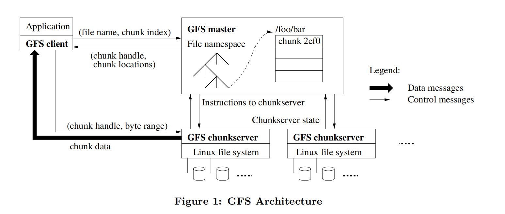

[toc]
# 
The Google File System

## 摘要
&emsp;&emsp;我们设计并实现了谷歌文件系统，这是一个可扩展的分布式文件系统，适用于大型分布式数据密集型应用程序。它在廉价的商用硬件上运行时提供容错性，并为大量客户机提供高聚合性能。

&emsp;&emsp;虽然与以前的分布式文件系统有许多相同的目标，但我们的设计是由对应用程序工作负载和技术环境的观察驱动的，包括当前的和预期的，这反映了与早期的一些文件系统假设的明显不同。这促使我们重新审视传统的选择，并探索完全不同的设计点。
该文件系统已成功满足我们的存储需求。

&emsp;&emsp;它被广泛部署在谷歌中，作为我们服务使用的数据生成和处理的存储平台，以及需要大型数据集的研究和开发工作。迄今为止最大的集群在1000多台机器上的数千个磁盘上提供数百tb的存储，并且可以由数百个客户机并发访问。

## 类别和主题描述符
分布式文件系统

## 关键字
容错(Fault tolerance)、可伸缩性(scalability)、数据存储(data storage)、集群存储(clustered storage)

## 1.介绍
&emsp;&emsp;为了满足谷歌快速增长的数据处理需求，我们设计并实现了谷歌文件系统(GFS)。GFS与以前的分布式文件系统有许多相同的目标，比如性能、可伸缩性、可靠性和可用性。然而，它的设计是由对我们应用负载和技术环节的探索所驱动的，无论是现在还是未来，都与之前的文件系统设计上有明显的区别。我们重新验证了传统的文件系统，并探索出完全不同的设计

&emsp;&emsp;首先，组件故障是常态，而不是例外。文件系统由数百甚至数千台存储机器组成，这些存储机器由廉价的商品部件构建而成，并由相当数量的客户机访问。组件的数量和质量实际上保证了一些组件在任何给定的时间都不能正常工作，一些组件将无法从当前的故障中恢复。我们已经看到了由应用程序错误、操作系统错误、人为错误以及磁盘、内存、连接器、网络和电源故障引起的问题。因此，持续监控、错误检测、容错和自动恢复必须是系统的组成部分

&emsp;&emsp;其次，按照传统标准，文件是巨大的。多gb文件很常见。每个文件通常包含许多应用程序对象，例如web文档。当我们经常处理由数十亿个对象组成的tb级快速增长的数据集时，管理数十亿个大约kb大小的文件是非常笨拙的，即使文件系统可以支持它。因此，必须重新考虑设计假设和参数，例如I/O操作和块大小。

&emsp;&emsp;第三，**大多数文件是通过附加新数据而不是覆盖现有数据来改变的**。**文件**中的**随机写**实际上是**不存在**的。一旦写入，文件就只能被读取，而且通常只能按顺序读取。各种数据都具有这些特征。其中一些可能构成数据分析程序扫描的大型存储库。有些可能是由运行的应用程序连续生成的数据流。有些可能是档案资料。有些可能是在一台机器上产生的中间结果，在另一台机器上处理，无论是同时（及时）处理还是稍后处理。考虑到这种对大文件的访问模式，追加成为性能优化和原子性保证的重点，而在客户机中缓存数据块则失去了吸引力。

&emsp;&emsp;第四，协同设计应用程序和文件系统API通过增加我们的灵活性使整个系统受益。例如，我们放宽了GFS的一致性模型，以极大地简化文件系统，而不会给应用程序带来繁重的负担。我们还引入了原子追加操作，以便多个客户机可以并发地追加到一个文件，而无需在它们之间进行额外的同步。这些将在本文后面进行更详细的讨论。
目前部署了多个GFS集群用于不同的目的。最大的数据库有超过1000个存储节点，超过300 TB的磁盘存储，并且在不同的机器上有数百个客户端连续地大量访问。

## 2.设计概述
### 2.1 假设
&emsp;&emsp;在为我们的需求设计文件系统时，我们一直受到各种假设的指导，这些假设既提供了挑战，也提供了机遇。我们之前提到了一些关键的观察结果，现在更详细地列出我们的假设。
* 该系统是由许多经常失效的廉价商品组件构建而成的。它必须不断地监控自身，并在常规基础上检测、容忍组件故障，并迅速从组件故障中恢复。
* 系统存储少量的大文件。我们期望有几百万个文件，每个**文件的大小**通常为**100mb或更大**。多gb文件是常见的情况，应该有效地管理。**必须支持小文件，但我们不需要针对它们进行优化**。
* **工作负载**主要包括**两种类型的读**:**大的流读**和**小的随机读**。在大型流读取中，单个操作通常读取数百kb，更常见的是1mb或更多。来自同一客户机的连续操作通常读取文件的连续区域。一个小的随机读取通常以一些任意偏移读取几个kb。注重性能的应用程序通常对它们的小读取进行批处理和排序，以便在文件中稳定地前进，而不是来回移动。
* 这些工作负载还有许多大的、顺序的写操作，将数据附加到文件中。典型的操作大小与读操作大小相似。文件一旦写入，就很少再被修改。**支持在文件中的任意位置进行小的写操作，但不一定要高效**。
* 系统必须有效地为并发追加到同一文件的多个客户端实现定义良好的语义。我们的文件通常用作生产者-消费者队列或用于多路合并。数百个生产者，每台机器运行一个，将并发地追加到一个文件。具有最小同步开销的原子性是必不可少的。该文件可以稍后读取，或者消费者可以同时读取该文件。
* 高持续带宽比低延迟更重要。我们的大多数目标应用程序都重视以高速率批量处理数据，而很少有对单个读或写有严格的响应时间要求。

### 2.2接口
GFS提供了一个熟悉的文件系统接口，尽管它没有实现像POSIX这样的标准API。文件在目录中按层次组织，并由路径名标识。我们支持创建*create*、删除*delete*、打开*open*、关闭*close*、读取*read*和写入*write*文件的常用操作。
此外，GFS还具有快照*snapshot*和记录追加操作*record append*。快照以较低的成本创建文件或目录树的副本。记录追加允许多个客户端并发地向同一个文件追加数据，同时保证每个客户端追加的原子性。它对于实现多路合并结果和生产者-消费者队列非常有用，许多客户机可以同时追加到这些队列，而无需额外的锁定。我们发现这些类型的文件在构建大型分布式应用程序时是无价的。快照和记录追加将分别在3.4节和3.3节中进一步讨论。

### 2.3架构
&emsp;&emsp;**GFS集群**由**单个主服务器（master）**和**多个块服务器(chunkservers)**组成，并由**多个客户端(client)**访问，如图1所示。这些机器通常都是运行用户级服务器进程的普通Linux机器。在同一台机器上同时运行块服务器程序和客户程序是很容易的，只要机器资源允许，并且运行可能不可靠的应用程序代码所导致的较低的可靠性是可以接受的。文件被分成固定大小的块。每个块由一个不可变且全局唯一的64位块句柄标识，该句柄是在块创建时由主服务器（master）分配的。Chunkserver将块以Linux文件的形式存储在本地磁盘上，并通过块句柄和字节范围指定读取或写入块数据。为了提高可靠性，每个块都在多个块服务器上复制。默认情况下，我们存储三个副本，不过用户可以为文件名称空间的不同区域指定不同的复制级别。

&emsp;&emsp;Master维护所有文件系统元数据。这包括名称空间、访问控制信息、从文件到块的映射以及块的当前位置。它也控制了一些系统层的行为，如块的租约管理，孤儿块的垃圾回收，以及块服务器间的块迁移。Master周期性的与每个块服务器进行通信，通过心跳信息发送指令并收集块服务器状态。

&emsp;&emsp;GFS客户端代码被嵌入到每个应用中，实现了文件系统的API，代表客户端进行读或写数据，与主节点和块服务器进行通信。客户端与主节点(master)只进行元数据的交互操作，而所有数据相关的通信都直接与块服务器进行。我们不提供POSIX API，因此不需要对Linux vnode层使用钩子。客户端与主服务器交互进行元数据操作，但所有承载数据的通信都直接与chunkserver进行。我们不提供POSIX API，因此不需要挂钩到Linux vnode层。

&emsp;&emsp;无论是客户端还是块服务器都不缓存文件数据。客户端缓存几乎带来不了任何好处，因为大多数应用以流的形式读入海量文件，或者工作集过大而不能被缓存。**没有缓存机制可以简化客户端和整个系统之间的一致性问题（然而，客户端缓存元数据）** chunkserver不需要缓存文件数据，因为块存储为本地文件，因此Linux的缓冲区缓存已经将频繁访问的数据保存在内存中。

### 2.4单一主节点（single Master）
&emsp;&emsp;拥有单一主节点能够极大的简化我们的设计，并且能使主节点根据整体的信息精确定位块（chunk）的位置以及进行复制决策。然而，我们必须尽量减少它对读写的参与，这样它才不会成为瓶颈。客户端从不通过主服务器读写文件数据。相反，客户端询问主服务器它应该联系哪个块服务器。它将这些信息缓存一段有限的时间，并直接与chunkserver交互以进行许多后续操作。
&emsp;&emsp;让我们通过Figure 1来解释一次简单的读取操作。首先，使用固定的块大小，客户机将应用程序指定的文件名和字节偏移量转换为文件中的块索引。然后，它向主机发送一个包含文件名和块索引的请求。主服务器返回相应的块句柄和副本的位置。客户端使用文件名和块索引作为key缓存这条信息。
&emsp;&emsp;然后，客户端向其中一个副本(很可能是最近的副本)发送请求。请求指定块句柄和该块中的字节范围。之后对相同块的读取就不再需要客户端和master的交互了，直到缓存信息过期或者文件被重新打开。事实上，客户端通常会在同一个请求中请求多个块，并且master也可以立即包含紧随其后的块的信息。这些额外的信息几乎不需要额外开销就可以避开未来的几次客户端到master的交互。

### 2.5Chunk Size
&emsp;&emsp;块大小是关键设计参数之一。我们选择了64MB，这比典型的文件系统块大小大得多。每个块副本作为普通Linux文件存储在一个chunkserver上，且只在需要的时候进行扩展。惰性空间分配（lazy space allocation）避免了因内部碎片而浪费空间，这可能是对如此大的块大小的最大争议。
&emsp;&emsp;一个较大的块大小提供了几个重要的优势。首先，它减少了客户端和master交互的需要，因为读写相同的块只需要对master发起一个询问块位置信息的初始请求。这个减少对于我们的工作负载尤其重要，因为应用程序通常都是顺序地读写大文件。即使对于小规模的随机读取，客户端也可以轻松地将数TB的工作集的所有的块位置信息缓存。其次，由于在大数据块上，客户端更有可能在给定数据块上执行许多操作，因此可以通过和chunkserver**保持更长时间持续的TCP连接**来**减少网络开销**[^1]。第三，它减少了存储在master的元数据的大小。第三，它减少了存储在master的元数据的大小。这使得我们能够把元数据保存在内存中，从而带来我们将会在Section2.6.1中将会讨论的其他的优势。
&emsp;&emsp;另一方面，一个大的块大小，即使是惰性空间分配，也有它的缺点。一个小文件由少量块组成，可能就一个块。如果很多客户端正在访问同一个文件，存储这些块的chunkserver可能会成为**热点（hot spot）**。在实践中，热点（hot spot）没有成为一个主要问题，因为我们的应用程序主要是顺序读取较大的具有多个块的文件。
&emsp;&emsp;尽管如此，当GFS最初用于一个批处理队列系统的时候，热点确实出现了：一个可执行程序作为一个单块文件被写到GFS里，然后同时在数百台机器上发起请求。通过以更高的复制因子来存储这样的可执行文件，并使批处理队列系统错开应用启动时间，我们修复了这个问题。**一个潜在的长期解决方案是允许客户端在这种情况下从其他客户端读取数据**。
[^1]: *TCP建立连接和断开有开销的，而数据块大一次连接时间就长，减少网络开销。*

### 2.6 Metadata
&emsp;&emsp;master存储了**三种主要类型**的元数据: **文件和块命名空间**，**文件到块的映射**，以及**每个块的副本的位置**。所有的元数据保存在master的内存中。前两种类型（命名空间和文件到块的映射）**持久化**，通过将变更记录到存储在master本地磁盘的**操作日志（operation log）** ，并且在远端机器备份。使用日志能使我们简单、可靠地更新master的状态，并且如果发生master崩溃（crash）也不会出现不一致的风险。**master不会对块位置信息**进行**持久化存储**[^2]。取而代之，它会**在master启动和chunkserver加入集群时询问每个chunkserver关于该chunkserver上的块（信息）**。

[^2]: *这和前面持久化有区别。*
#### 2.6.1 内存中的数据结构（In-Memory Data Structures）
&emsp;&emsp;由于元数据存储在内存中，master上的操作是很快的。此外，master可以简单高效地在后台周期性扫描它的记录状态。这个周期性扫描用于实现块的垃圾回收，在chunkserver失效时进行重新复制（re-replication），以及块迁移，块迁移是为了在chunkserver之间均衡负载和磁盘空间使用。Section 4.3和 4.4将会更深入地讨论这些内容。
&emsp;&emsp;这种仅使用内存的方式的一个潜在问题是，块的数量和整个系统的容量受限于master的内存大小。这在实践中不是一个很严重的限制。master为每个64MB大小的块维护了不到64字节的元数据。大多数块是填满的，因为大多数文件包含许多块，只有最后的块可能是部分填充的。类似的，文件命名空间数据通常每个文件需要不到64字节，因为它使用前缀压缩来紧凑地存储文件名。
&emsp;&emsp;如果需要支持更大的文件系统，相对于在内存中存储元数据所获得的简单性、可靠性、性能和灵活性来说，向master添加额外内存的成本是很小的开销。
#### 2.6.2 块位置（Chunk Locations）
&emsp;&emsp;关于哪个chunkserver拥有一个给定块的副本，master对此没有保存持久化的记录。它只是简单地在启动时对chunkserver轮询那些信息。master可以在之后保持最新状态，因为它通过周期性的心跳（HeartBeat） 消息控制所有的块放置并监控chunkserver的状态。
&emsp;&emsp;我们最初尝试把块位置信息在master上持久化保存，但是我们认为在启动时以及之后周期性地从chunkserver请求数据会更简单。这样消除了在当chunkserver加入和离开集群、更改名称、失效（fail）、重启诸如此类的情况时，保持master和chunkserver同步的问题。在一个拥有数百台服务器的集群中，这些事件会经常发生。
&emsp;&emsp;理解这个设计决策的另一种方式是认识到chunkserver对它自己的磁盘上有什么块或没有什么块有最终决定权。试图在master上维护这个信息的一致视图是没有意义的，因为chunkserver上的错误可能会导致块自动消失（例如，磁盘会坏掉并且无法启用），或者操作员可能会对chunkserver重命名。
#### 2.6.3 操作日志（Operation Log）